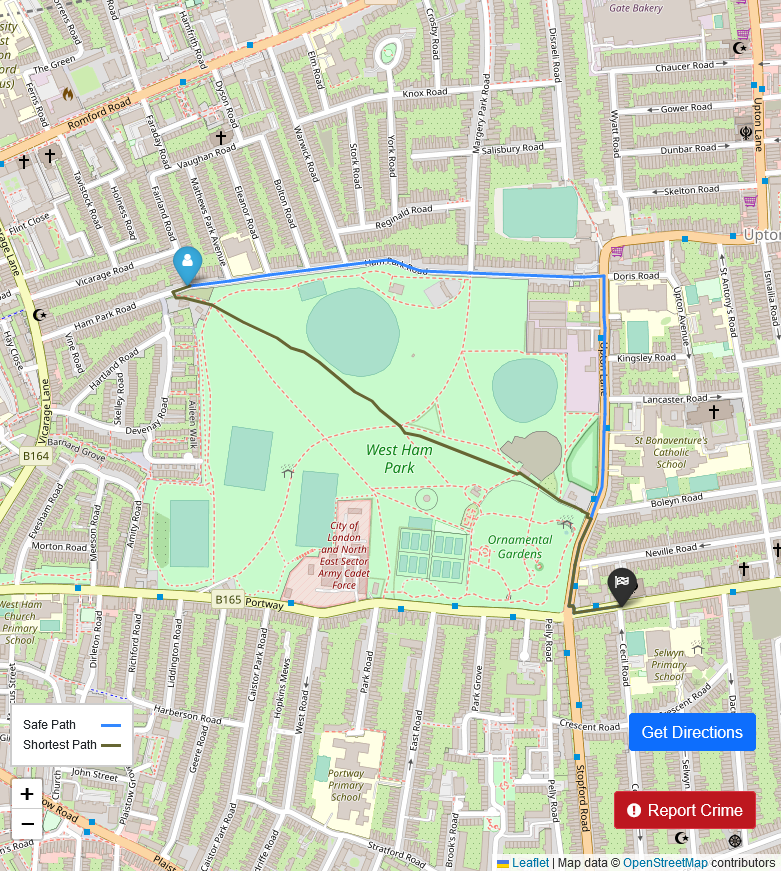
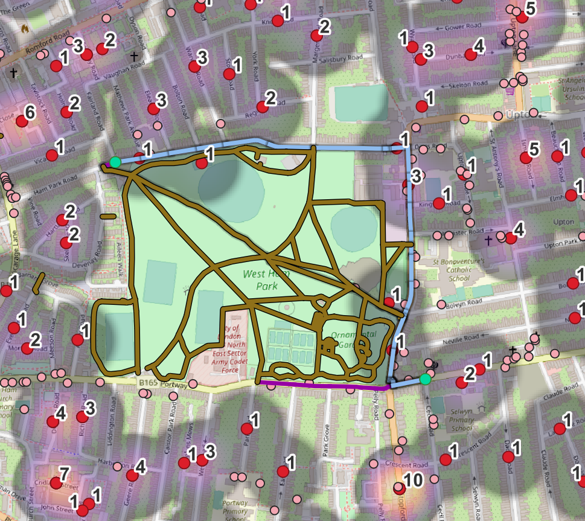

# Generating Safe Routes for Pedestrians: Avoiding Crime and Unsafe Roads
Report of my final year project written in 2022 for my BSc. in Computer Science. It's just for archival purposes.

This report/article aims to provide methods for planning a safe route for pedestrians. This was
achieved by creating a cost algorithm that takes
in consideration crime density on streets provided by the [police of England, Northern Ireland and Wales](https://data.police.uk/), and
road data provided by OpenStreetMaps. The algorithm effectively creates different and safer
routes than popular navigations software such as Google Maps where it only focus on the fastest route.
To prove the usability of the algorithm, an interactive Web Application was also created.

**Example of route:** Starting near a park and needing to go to the other side

Instead of going through the Park, it advises to go around it because the park is not lit at night, so it's dangerous to walk there during that time.
 
Web app:

Visualization through the QGIS software with the red dots as crime areas, pink dots as areas that might aggregate people, brown lines are the unlit paths, blue lines represent the safest route:

